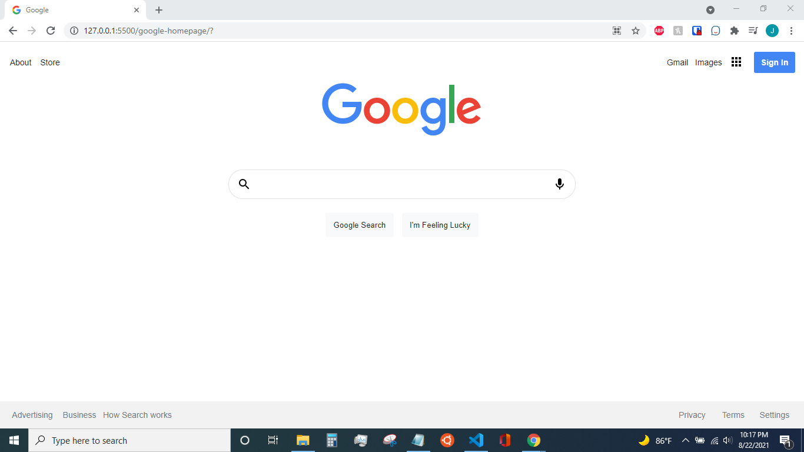

# Google Homepage
## This is our **first** mini-project!

In this project, we will implement everything we've learned so far to recreate the google homepage. The links and search boxes dont go anywhere, but the goal is to start thinking about how elements get placed on the page and roughly how they get styled and aligned. 

This project also serves as an introduction to file mangement and implementation of git.

A demo of the webpage can be seen <a href="https://whiskey-hotel.github.io/google-homepage/">here</a>.

